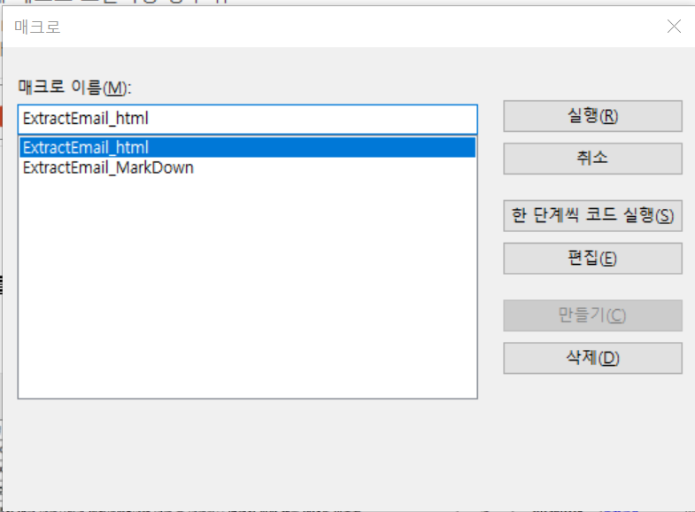

# Outlook to Obsidian Markdown Converter

## 🔹 프로젝트 개요
업무에서 Obsidian을 활용해 정보를 관리하고 있지만, 안타깝게도 **Outlook 이메일을 직접 Obsidian으로 연동하는 기능은 제공되지 않습니다**. 

각종 커뮤니티와 GitHub 프로젝트를 조사한 결과, 일부 자동화 솔루션이 존재했지만, 이메일을 Markdown 파일로 완벽하게 변환하는 기능은 부족했습니다. 

그래서 직접 **이메일을 Markdown 파일로 변환하고 Obsidian에서 바로 활용할 수 있도록 개발**했습니다!

.png)

---

## 🚀 주요 기능
✅ **이메일을 Markdown 형식으로 변환**
   - 발신자, 수신자, 날짜 등의 메타데이터를 자동으로 포함합니다.
   - 본문을 Markdown 형식으로 변환하며, 표, 이미지, 첨부파일을 지원합니다.

✅ **Obsidian과 즉각적인 통합**
   - 변환된 Markdown 파일을 Obsidian에서 자동으로 열어 기존 노트와 연결할 수 있습니다.

✅ **첨부파일 관리 기능**
   - 이메일의 첨부파일을 지정된 폴더에 저장하여 체계적인 관리가 가능합니다.

✅ **두 가지 변환 기능 지원**
   `Alt + F8`을 누르면 아래 두 가지 함수가 실행 가능:
   
   1️⃣ **ExtractEmail_MarkDown** - 이메일을 Markdown 파일로 변환
   
   2️⃣ **ExtractEmail_html** - 이메일을 HTML 파일로 변환



---

## 📂 파일 구성
- `SaveEmail.bas` - 이메일을 추출하고 변환하는 메인 로직
- `SaveUtilities.bas` - 이메일 처리 및 변환을 돕는 유틸리티 함수들
- `USER_CONFIG.bas` - 사용자가 설정을 조정할 수 있는 파일

---

## 🔧 설치 및 설정 방법
1️⃣ **Outlook에서 VBA 편집기 열기**
   - `Alt + F11`을 눌러 VBA 편집기를 실행합니다.

2️⃣ **`.bas` 파일을 모듈에 추가**
   - VBA 편집기에서 `File` > `Import File`을 선택하여 `SaveEmail.bas`, `SaveUtilities.bas`, `USER_CONFIG.bas`를 추가합니다.

3️⃣ **참조 라이브러리 설정**
   - VBA 편집기에서 `Tools` > `References` 선택 후, 아래 항목 체크:
     - `Microsoft Forms 2.0 Object Library`
     - `Microsoft VBScript Regular Expressions 5.5`

4️⃣ **사용자 설정 변경 (`USER_CONFIG.bas`)**
   - `ObsidianFolder`와 `baseFolder` 값을 적절히 설정하세요.
   ```vb
   Public ObsidianFolder = "D:\backup_archive\obsidian archive\" ' 옵시디언 저장소 경로
   Public baseFolder = "Attached\__emails__\" ' 다운로드 받은 이메일 HTML 저장 경로
   ```

---

## 🛠 사용 방법
1️⃣ Outlook에서 변환할 이메일을 선택합니다.
2️⃣ `Alt + F8`을 누르고 원하는 변환 함수 실행:
   - `ExtractEmail_MarkDown` → Markdown 변환 후 Obsidian에서 열기
   - `ExtractEmail_html` → HTML 형식으로 변환 후 저장

### 📌 변환 결과 예시
✅ **Markdown 변환 결과**
_1(blur).png)
_2(blur).png)

✅ **HTML 변환 결과**
_1(blur).png)
_2(blur).png)

---

## 📌 향후 개선 방향 및 피드백 환영!
이 프로젝트는 이메일을 효율적으로 Obsidian에 저장하는 것을 목표로 합니다. 추가되었으면 하는 기능이 있다면 자유롭게 의견을 주세요! 누구든지 환영합니다. 😊

---

## 🔗 참고한 프로젝트
이 프로젝트는 다음 솔루션을 참고하여 개선되었습니다:
- [machado-t/Outlook2Obsidian](https://github.com/machado-t/Outlook2Obsidian)
- [tallguyjenks/Obsidian-For-Business](https://github.com/tallguyjenks/Obsidian-For-Business)

